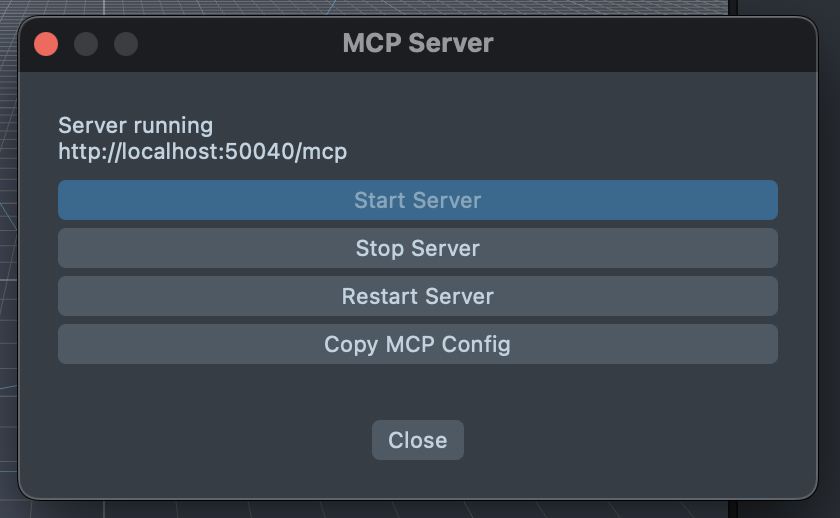
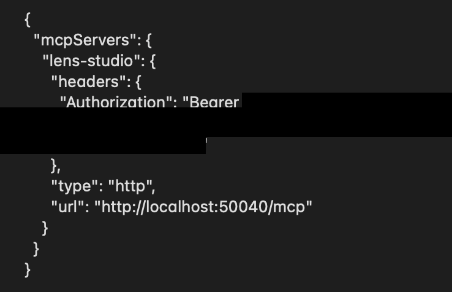

# Install reference — self-service guide

Complete step-by-step install guide for the `lens-studio-snapchat-filter` skill. **This is the backup path** for users who prefer to install on their own rather than be guided live by the agent.

The agent's interactive concierge mode is faster for most users (~25-30 min, with adaptive troubleshooting). Use this doc when:

- You want to read everything upfront before starting
- You're comfortable working from documentation
- You've started concierge mode but want to finish self-service
- You're setting up multiple machines and want a repeatable checklist

If you get stuck at any step, return to Claude Code and say "I'm stuck on step [X] of INSTALL-REFERENCE.md, [describe symptom]" — the agent will switch to interactive troubleshooting.

## Contents
- Prerequisites
- Step 1: Install Claude Code
- Step 2: Install Lens Studio 5.20+
- Step 3: Install the skill
- Step 4: Verify skill install
- Step 5: Per-project setup
- Step 6: Register MCP server
- Step 7: Sanity check
- MCP token: re-registration and rotation
- Permission prompts you'll see

## Prerequisites

- **macOS** — the scripted install (`bin/install.sh`) supports macOS only. This manual reference works on Windows and Linux for users who can adapt the shell commands themselves; automated Linux/WSL support is deferred.
- 10 GB free disk space (Lens Studio is ~3 GB)
- Internet connection
- Admin rights to install applications

## Step 1: Install Claude Code

If you already have Claude Code working (you're talking to it), skip to Step 2.

In your terminal, run the one-line installer:

```bash
curl -fsSL https://claude.ai/install.sh | bash
```

Verify:

```bash
which claude
# Should return: /opt/homebrew/bin/claude (or similar)

claude --version
# Should return a version number
```

If `which claude` returns nothing, your PATH may not include the install directory. Add it to `~/.zshrc` (macOS) or equivalent:

```bash
export PATH="/opt/homebrew/bin:$PATH"
```

Reload: `source ~/.zshrc`, then `which claude` again.

## Step 2: Install Lens Studio 5.20+

Download from <https://ar.snap.com/download>.

After install:
- Open Lens Studio
- Welcome screen appears with options like "New Project", "Open Recent", etc.
- Sign in to your Snap account when prompted (Menu Bar → **My Lenses → Login**) — this enables the Knowledge Base query tool and is required for the Submit panel later

If LS won't open or crashes immediately:
- Confirm version: should be 5.20 or later (older versions have different APIs)
- Try resetting LS preferences: `Shift+Option-click` the LS icon → "Reset Preferences"
- macOS Gatekeeper: right-click LS app in Applications → Open → "Open anyway"

## Step 3: Install the skill

> [!NOTE]
> All commands in this step run in your **terminal** (Terminal.app or iTerm on macOS). Open it now if you don't have it open yet. All commands from here through Step 7 run in the same terminal window.

You received the skill as one of:

### Option A: `.skill` file (zip archive)

```bash
mkdir -p ~/.claude/skills
unzip lens-studio-snapchat-filter.skill -d ~/.claude/skills/
# Result: ~/.claude/skills/lens-studio-snapchat-filter/SKILL.md exists
```

**Verify:** run `ls ~/.claude/skills/` — you should now see `lens-studio-snapchat-filter/` in the listing.

If `unzip` fails (because the file has `.skill` extension, not `.zip`), rename first:

```bash
cp lens-studio-snapchat-filter.skill ~/Downloads/lens-studio-snapchat-filter.zip
cd ~/Downloads
unzip lens-studio-snapchat-filter.zip -d ~/.claude/skills/
```

### Option B: Git clone (internal Valtech repo or GitHub)

```bash
git clone <repo-url> ~/.claude/skills/lens-studio-snapchat-filter
```

For updates later: `cd ~/.claude/skills/lens-studio-snapchat-filter && git pull`.

### Option C: Manual copy (zip + extract from email/Slack/Drive)

Same as Option A — unzip the archive contents into `~/.claude/skills/lens-studio-snapchat-filter/`.

## Step 4: Verify skill install

```bash
ls ~/.claude/skills/lens-studio-snapchat-filter/SKILL.md
# Should print the path (not an error)
```

In Claude Code:

```bash
cd ~  # any directory works for this test
claude
```

Then in the Claude Code session, ask:

> "How do I scaffold a new Snapchat lens project?"

Expected response:
- Claude references the 5-phase pipeline (Phase 0 → Phase 5)
- Claude mentions `references/phase-progression.md` or `references/mcp-setup.md`
- Claude offers to walk you through setup

If Claude responds without mentioning Lens Studio specifics or pipeline phases, the skill isn't loading. Check:

```bash
ls ~/.claude/skills/lens-studio-snapchat-filter/
# Should show: SKILL.md  references/  docs/  assets/
```

If missing files: re-install per Step 3.

## Step 5: Per-project setup

For each new lens project, create a project folder.

```bash
mkdir -p ~/Projects/[client]-lens
cd ~/Projects/[client]-lens
```

Substitute `[client]` with the actual name in kebab-case.

**Example** — for a hypothetical footwear-brand project:

```bash
mkdir -p ~/Projects/example-lens
cd ~/Projects/example-lens
```

When the command finishes, you're *inside* the project folder — the terminal prompt now shows the folder name.

**Verify:** open Finder → Projects. You'll see a new `example-lens` folder. This is where Claude will create subfolders (`docs/`, `brief/`, etc.) in the next phase.

Inside the project folder, create the sub-structure:

```bash
mkdir -p project-info INSPIRATION/{visual-style,motion-references,color-palette-refs,ui-references} brand-assets lens docs
```

Copy the project template files (CC will do this automatically in concierge mode; for manual setup):

```bash
cp ~/.claude/skills/lens-studio-snapchat-filter/assets/project-template/PROJECT-STATE.md ./PROJECT-STATE.md
cp ~/.claude/skills/lens-studio-snapchat-filter/assets/project-template/PROJECT-PLAN.md ./PROJECT-PLAN.md
cp ~/.claude/skills/lens-studio-snapchat-filter/assets/project-template/.gitignore ./.gitignore
cp ~/.claude/skills/lens-studio-snapchat-filter/assets/project-template/lens-folder.gitignore ./lens/.gitignore
git init
```

In Lens Studio:
1. **File → New Project**
2. **File → Save As** → navigate to `~/Projects/[client]-lens/lens/`
3. Save as `[ClientName].esproj` (e.g., `SpotifyLens.esproj`)

## Step 6: Register MCP server

The Lens Studio MCP server lets Claude Code make scene mutations, run scripts in your LS project, and query state. Without MCP, you'll still get instructions but you'll execute scene changes manually in the LS GUI.

### Get credentials

> [!NOTE]
> This step uses **two windows**: Lens Studio (to read the port + token) and your terminal (to register them with Claude). Follow the steps in order.

**1. Open the MCP Server panel in Lens Studio:**

**AI Assistant → AI Model Context Protocol (MCP) → Configure Server**



*MCP Server panel — find the **Copy MCP Config** button.*

**2. Click "Copy MCP Config".** The full server config (URL + Bearer token) is now in your clipboard as a JSON blob.

> [!WARNING]
> **3. Do NOT paste the JSON in the terminal yet.** Paste it into a text editor (TextEdit, VS Code, Sublime — whatever you have open). The JSON blob is **information**, not a command. Pasting it into your shell will produce a `parse error` and nothing will work.



*JSON config — note the port (after `localhost:`) and the token (after `Bearer`).*

**4. Find the two values you need in the JSON:**

- **Port** — the number after `localhost:` in the `url` field (e.g., `50040`).
- **Token** — the long random string after `Bearer ` in the `headers.Authorization` field.

**5. Now go to your terminal** and run the command in the next section, replacing `PORT` and `YOUR_TOKEN_HERE` with the values from the JSON.

### Register with Claude Code

```bash
cd ~/Projects/[client]-lens
claude mcp add --transport http --scope local lens-studio http://localhost:PORT/mcp \
  --header "Authorization: Bearer YOUR_TOKEN_HERE"
```

**Example** — with real values filled in:

```bash
claude mcp add --transport http --scope local lens-studio http://localhost:50040/mcp \
  --header "Authorization: Bearer abc123def456..."
```

Replace `PORT` (e.g., `50040`) with the port LS showed you, and `YOUR_TOKEN_HERE` with the actual Bearer token.

> [!WARNING]
> Run the command as **one line** (or with the `\` line-continuation as shown). Don't press Enter in the middle of the command. If the terminal visually wraps the long line, that's fine — only a literal Enter breaks the command.

**Scope choice**:
- `--scope local`: registration scoped to current directory (recommended for project-specific work)
- `--scope user`: registration in `~/.claude.json`, available globally. Use if you switch frequently between projects.

### Verify

```bash
claude mcp list
```

Expected output line:

```
lens-studio: http://localhost:50040/mcp (HTTP) - ✓ Connected
```

If you see `✗ Failed to connect` or `401 Unauthorized`, see TROUBLESHOOTING.md → "MCP not connecting".

## Step 7: Sanity check

Start Claude Code in your project folder:

```bash
cd ~/Projects/[client]-lens
claude
```

> [!NOTE]
> Run this in the same terminal window, from your project folder (e.g., `example-lens`). This starts the Claude Code CLI — you'll land in an interactive chat prompt where you type messages directly to Claude.

Ask:

> "Read the current scene from Lens Studio and tell me what objects are there."

Expected: Claude runs a `scene-graphql` query, reports objects like `Camera Object`, `Lighting`, and any project-specific objects you've added.

If Claude reports "MCP not connected" or "no tool available", go back to Step 6 and re-register.

## You're done with install — start building

In your project folder, tell Claude Code:

> "I want to build a Snapchat lens for [client]. Here's the brief: [paste 1-2 paragraphs]."

Claude will:
1. Read INSPIRATION/ (if you've added images) and infer design direction
2. Surface 2-4 targeted clarifying questions (8-question / 3-group onboarding intake)
3. Draft TECH-SPEC.md and USER-EXPERIENCE.md for your review
4. After your approval, begin Phase 0 of the build

The full pipeline (Phase 0 → Phase 5) is documented in `~/.claude/skills/lens-studio-snapchat-filter/references/phase-progression.md`, but you don't need to read it — Claude walks you through each phase.

## MCP token: re-registration and rotation

The MCP Bearer token in Lens Studio is **long-lived** — empirically verified to persist across both LS app restarts and the MCP server's Stop/Start cycle (tested on LS 5.21). If `claude mcp list` shows the lens-studio server as `✓ Connected`, your stored token still works and you don't need to do anything.

If your registration starts failing (`✗ Failed to connect` or `401 Unauthorized`), re-register with the current token:

1. Get the current token from LS as in Step 6 above (**AI Assistant → MCP → Configure Server** → **Copy MCP Config** → paste into a text editor to read the port and token).
2. Re-register:

```bash
claude mcp remove lens-studio
claude mcp add --transport http --scope local lens-studio http://localhost:NEW_PORT/mcp \
  --header "Authorization: Bearer NEW_TOKEN"
claude mcp list
# Verify: ✓ Connected
```

If you'd rather have Claude walk you through this when it happens, just tell Claude "MCP isn't working" — it'll guide you through reconnect.

> [!WARNING]
> Treat the MCP Bearer token like a password — don't share screenshots, logs, or messages that include it. If you suspect a leak, the most reliable way to force token rotation in current LS versions is to **reset Lens Studio preferences**: hold ⇧⌥ while launching LS → "Reset Preferences". Stop/Start the MCP server from the panel does *not* reliably rotate the token (verified on LS 5.21).

## Permission prompts you'll see

First time Claude runs certain commands, Claude Code will ask for permission. Common ones:

- **MCP tool calls** (`mcp__lens-studio__*`) — first call to scene-graphql, asset-graphql, RunAndCollectLogsTool, etc. Allow them.
- **Bash commands** (`mkdir`, `mv`, `git add`, `git commit`, etc.) — first call per command type. Allow them.
- **File writes** (Write, Edit tools) — first call per directory. Allow them.

You can pre-approve future calls in the prompt UI. For lens projects, the common allow-list is:

- `Bash(git *)`
- `Bash(mkdir *)`
- `Bash(claude mcp *)`
- `mcp__lens-studio__*`
- File writes within `~/Projects/[client]-lens/`

You're in control — only approve what makes sense. If you see a permission prompt for something unexpected (e.g., a destructive `rm -rf` or a network call outside your project), deny it and ask Claude what it's trying to do.

## See also

- `docs/TROUBLESHOOTING.md` — when something doesn't work after install
- `references/` — internal docs (CC reads these to know how to guide you; you don't normally need to)
